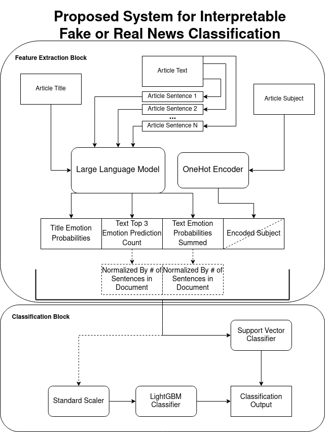

# News Authentication Via Emotion (NAVE)

**Alexander Epstein**

**Northeastern University**

## Description
A method for utilizing a large language model (LLM) as a way to generate
intermediate interpretable features for the downstream task of fake or real news classification.
The LLM generates fine grained emotion sentiment analysis on both the title and each
sentence of the article from which the features are exracted. Then these features are
processed through a simpler classifier to determine the authenticity of the sample news
article. Results of the final classifier indicate a test accuracy of ~89% suggesting the practical
usage of this model in authenticating news articles.

## Motivation
Machine Learning advancements have enabled large performance improvements in various
problems spanning both scientific research and business. However one of the pitfalls of
complex architectures that have the ability to perform complex tasks are rarely interpretable
and even less so in Natural Language Processing. It is desired to provide insight into the way
that these models perform these tasks so that the outputs need not be taken immediately at
face value. This interpretability is instrumental in the adoption of Artificial intelligence in the
mainstream and ensures we have both fair and ethical intelligent systems. 

In the Age of Information it is shown that retractions in the scientific community are
detrimental to the societies understanding of the topics as retractions rarely garner the same
interest as the original misinformation. It is not a large leap to say that this phenomenon
would extend to news as well which can lead to disinformation spreading rapidly across our
society. If we seek to stop the spread of this misinformation we need to intervene at the
moment of either production or consumption of this information. This work seeks to tackle this
problem from the standpoint of consumption as this does not require any integration with the
publishers and can be applied more generically.

In this vein we saught to authenticate the trustworthiness of a news article utilizing
interpetable features. This has a two-fold impact, it allows us to attempt to provide information
to the consumer that grades the trustworthiness of the information possibly preventing the
spread of information, while attempting to make the models reasoning more interpretable,
allowing for the consumer to decide if they trust the output of the algorithm. 

## Pretrained Distill BERT Model
To be able to run the jupyter notbebook efficiently long computations outputs have been serialized to just load them upon new executions. To avoid having to train the Distill BERT model a pretrained model is provided for your conviencence. This model can be downloaded [here](https://drive.google.com/file/d/1x0EmEZ8bur4xO2CiLVnAStKVb_B_0aMt/view?usp=sharing). The model must be placed in the `model_outputs_distill` directory to be used in the notebook.

## Datasets

### GoEmotions Dataset

#### Link
https://github.com/google-research/google-research/tree/master/goemotions

####  License

Apache License 2.0

#### Acknowledgements

@inproceedings{demszky2020goemotions,
 author = {Demszky, Dorottya and Movshovitz-Attias, Dana and Ko, Jeongwoo and Cowen, Alan and Nemade, Gaurav and Ravi, Sujith},
 booktitle = {58th Annual Meeting of the Association for Computational Linguistics (ACL)},
 title = {{GoEmotions: A Dataset of Fine-Grained Emotions}},
 year = {2020}
}

### Fake or Real News Dataset

#### Link
https://www.kaggle.com/datasets/clmentbisaillon/fake-and-real-news-dataset

####  License

Unknown

#### Acknowledgements

Ahmed H, Traore I, Saad S. “Detecting opinion spams and fake news using text classification”, Journal of Security and Privacy, Volume 1, Issue 1, Wiley, January/February 2018.
Ahmed H, Traore I, Saad S. (2017) “Detection of Online Fake News Using N-Gram Analysis and Machine Learning Techniques. In: Traore I., Woungang I., Awad A. (eds) Intelligent, Secure, and Dependable Systems in Distributed and Cloud Environments. ISDDC 2017. Lecture Notes in Computer Science, vol 10618. Springer, Cham (pp. 127-138).

## License 
[MIT License](LICENSE)